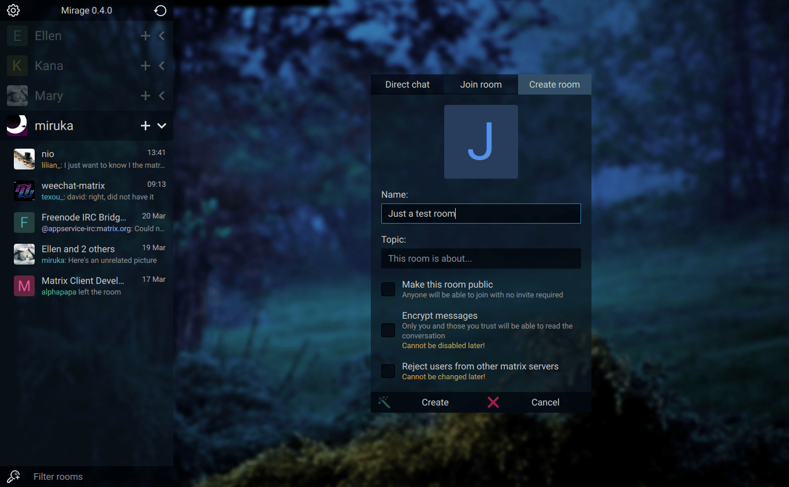
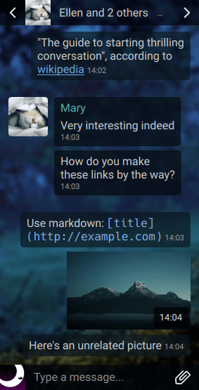

# Mirage

[Features](#currently-implemented-features) ⬥
[Installation](docs/INSTALL.md) ⬥
[Keybindings](docs/KEYBINDINGS.md) ⬥
[Configuration](docs/CONFIG.md) ⬥
[Theming](docs/THEMING.md) ⬥
[Contributing](docs/CONTRIBUTING.md) ⬥
[Screenshots](#screenshots)

A fancy, customizable, keyboard-operable [Matrix](https://matrix.org/) chat
client for encrypted and decentralized communication.  
Written in Qt/QML and Python, **currently in alpha**.

## Currently Implemented Features

### General

- **Fluid, responsive interface** that adapts to any window size
- Toggleable **compact mode**
- Customizable **keyboard shortcuts** for everything, including
  switching rooms, navigating messages, sending/opening files...
- Versatile **theming system**, properties can refer to each other and have 
  any valid ECMAScript 7 expression as values
  - Comes by default with **dark** and **transparent themes**
- Desktop **notifications**, sounds and window alerts
- Support for HTTP and SOCKS5 proxies including TOR 

### Accounts

- Built-in public homeservers list
- **Multiple accounts** in one client
- **SSO** and password authentication
- Set your display name and profile picture
- Import/export **E2E** key files
- Inspect, rename, manually verify and sign out one or multiple **sessions**
- Sessions for accounts within the same client automatically verify each others
- Set your account's **presence** to online, unavailable, invisible or offline
- Set custom **status messages**
- Automatically set your status to unavailable after a period of inactivity
- Advanced **push rules** editor

### Rooms

- Create, join, leave and forget rooms
- Send, accept and refuse invites
- Edit the room's name, topic, invite requirement, guest access and enable E2E
- Kick, ban and set the power level of users

- Pin rooms to the top of the list 
- Unread message and highlight counters
- Sending **read receipts** to mark rooms as read
- Seeing who has read a message and when
- Inspect and manually **verify** other users's **E2E sessions**
- See other users's **presence, status message and last seen time**
- **Typing notifications**

### Messages

- Send and receive **E2E encrypted messages**
- Send and receive emote messages (e.g. `/me reads attentively`)
- Receive notice (bot) messages
- Send **markdown** formatted messages
  - Additional syntax for **coloring text**, e.g. `<red>(Some text...)` - 
    [SVG/CSS color names](https://www.december.com/html/spec/colorsvg.html),
    `#RGB`, `#RRGGBB` and `#AARRGGBB` hex codes can be used

- Send and receive normal or **E2E encrypted files**
- Client-side Matrix & HTTP URL **image previews**, including animated GIF 
- Upload images by pasting or drag-and-drop
- Full-size image viewer 

- User ID, display names, room ID and room aliases **mentions**
- **Autocompletion** for usernames and user ID
- Individual and mass **message removal**
- Sending **rich replies**

## Documentation

- [Installation](docs/INSTALL.md)
- [Keybindings](docs/KEYBINDINGS.md)
- [Configuration](docs/CONFIG.md)
- [Theming](docs/THEMING.md)
- [Contributing](docs/CONTRIBUTING.md)

## Screenshots

