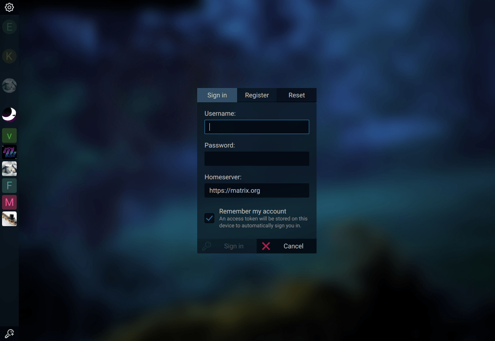
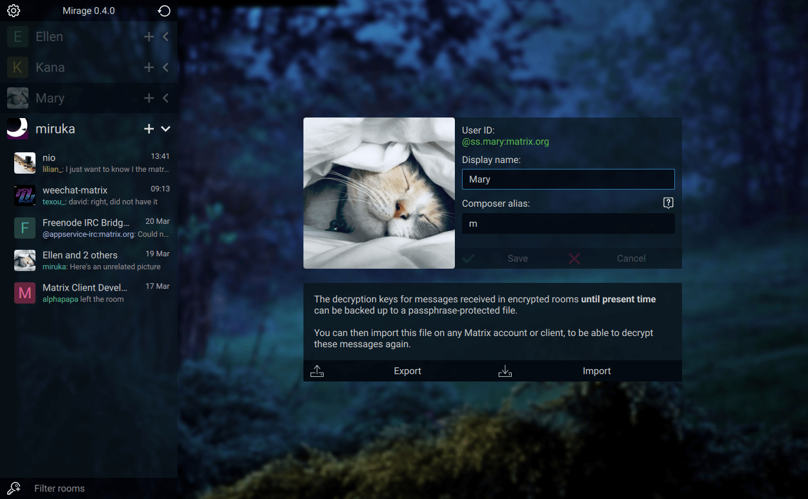
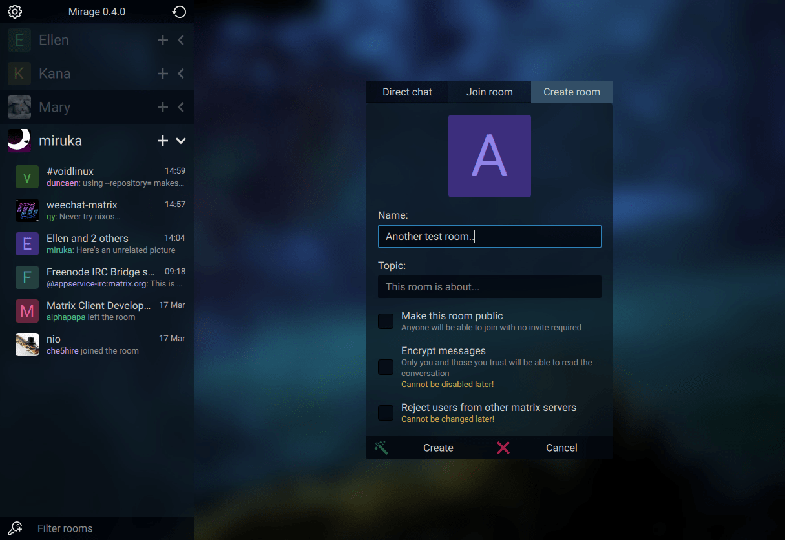
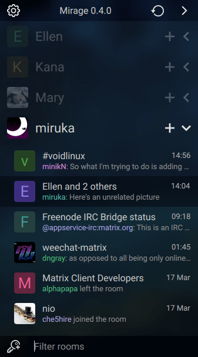
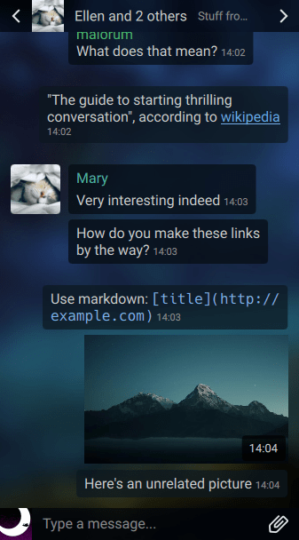
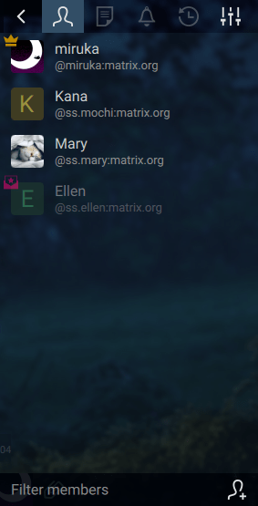

# Mirage

[](https://github.com/mirukana/mirage/releases)
[](https://github.com/poljar/matrix-nio)
[](https://matrix.to/#/#mirage-client:matrix.org)

[Features](#currently-implemented-features) ⬥
[Installation](INSTALL.md) ⬥
[Configuration & Theming](#configuration--theming) ⬥
[Screenshots](#more-screenshots)

A fancy, customizable, keyboard-operable [Matrix](https://matrix.org/) chat
client for encrypted and decentralized communication.  
Written in Qt/QML and Python, **currently in alpha**.


## Currently Implemented Features

### Interface

- **Fluid, responsive interface** that adapts to any window size
- Toggleable **compact mode**
- Customizable **keyboard shortcuts** for everything, including
  switching rooms, navigating messages, sending/opening files...
- Versatile **theming system**, properties can refer to each other and have 
  any valid ECMAScript 7 expression as values
  - Comes by default with **dark** and **transparent themes**

### Accounts

- **Multiple accounts** in one client
- Built-in public homeservers list
- **SSO** and password authentication
- Set your display name and profile picture
- Import/export **E2E** key files
- Inspect, rename, manually verify and sign out one or multiple **sessions**
- Sessions for accounts within the same client automatically verify each others
- Set your account's **presence** to online, unavailable, invisible or offline
- Set custom **status messages**
- Automatically set your status to unavailable after a period of inactivity

### Rooms

- Create, join, leave and forget rooms
- Send, accept and refuse invites
- Edit the room's name, topic, invite requirement, guest access and enable E2E
- Kick, ban and set the power level of users

- Unread message and highlight counters
- Sending **read receipts** to mark rooms as read 
- Inspect and manually **verify** other users's **E2E sessions**
- See other users's **presence, status message and last seen time**
- **Typing notifications**

### Messages

- Send and receive **E2E encrypted messages**
- Send and receive emote messages (e.g. `/me reads attentively`)
- Receive notice (bot) messages
- Send **markdown** formatted messages
  - Additional syntax for **coloring text**, e.g. `<red>(Some text...)` - 
    [SVG/CSS color names](https://www.december.com/html/spec/colorsvg.html),
    and `#hex` codes can be used

- Send and receive normal or **E2E encrypted files**
- Client-side Matrix & HTTP URL **image previews**, including animated GIF 
- Upload images by pasting
- Full-size image viewer 

- User ID, display names, room ID and room aliases **mentions**
- **Autocompletion** for usernames and user ID
- Individual and mass **message removal**
- Sending **rich replies**

## Installation

See [INSTALL.md](INSTALL.md)

## Configuration & Theming

The config file can be found at *$XDG_CONFIG_HOME/mirage/settings.json*, 
or *~/.config/mirage/settings.json*.

For Flatpak users, this will be
*~/.var/app/io.github.mirukana.mirage/config/mirage* instead.

The config folder where *accounts.json* and  *settings.json* is located can be
overriden by setting the `MIRAGE_CONFIG_DIR` environment variable.  

The user data folder where *themes*, encryption data and interface states
are saved can be overriden with `MIRAGE_DATA_DIR`.

The cache folder where downloaded files and thumbnails are saved can be
overriden with `MIRAGE_CACHE_DIR`.

The `theme` setting can be:

- The filename of a built-in theme (`Midnight.qpl` or `Glass.qpl`)
- The filename of a custom theme at 
  *$XDG_DATA_HOME/mirage/themes*, *~/.local/share/mirage/themes*,
  or *~/.var/app/io.github.mirukana.mirage/data/mirage/themes* (Flatpak)

A default theme from this repository can be copied to use as a base and edit,
for example:

```sh
    cp mirage/src/themes/Midnight.qpl \
       "${XDG_DATA_HOME:-$HOME/.local/share}/mirage/themes/MyTheme.qpl"
```

Or for Flatpak users:

```sh
    cp mirage/src/themes/Midnight.qpl \
       ~/.var/app/io.github.mirukana.mirage/data/mirage/themes/MyTheme.qpl
```

The config setting `theme` would need to be set to `MyTheme.qpl` in this case.

Theme files are nested-by-indentations sections of properties and values.  
Properties are declared as `<type> <name>: <value>`.  
Values can be any JavaScript (ECMAScript 7) expressions.

Most of the properties are of type `color`.
Their values, if not just refering to another property,
can be expressed with a:
- [SVG/CSS color name](https://www.december.com/html/spec/colorsvg.html)
  string, e.g. `"blue"`
- Hexadecimal code string, e.g. `"#fff"` or `"#cc0000"`
- RGBA value, using the `Qt.rgba(0-1, 0-1, 0-1, 0-1)` function
- HSLA value, using the `Qt.hsla(0-1, 0-1, 0-1, 0-1)` function
- HSVA value, using the `Qt.hsva(0-1, 0-1, 0-1, 0-1)` function
- [HSLUV](https://www.hsluv.org/) value, using the
  `hsluv(0-360, 0-100, 0-100, 0-1)` function. This is the prefered method 
  used throughout the default theme files
  (why? see [this](https://www.hsluv.org/comparison/#rainbow-hsluv) and
  [that](https://www.boronine.com/2012/03/26/Color-Spaces-for-Human-Beings/#hsl-is-a-lemon))

If you just want to change the background picture,
or use a gradient/simple color instead, search for the `ui:` section in your
text editor.


With `Alt+Shift+R` by default, the config and theme can be reloaded without 
restarting the app.

**Warnings**: 

- API currently unstable: theme properties are often renamed, added or deleted.
- The file format for both config and themes will soon change
- The current file format forces all theme to have all properties
  defined, instead of being able to only specify the ones to override from the
  default theme.

GUI settings will also be implemented in the future.

## Screenshots









